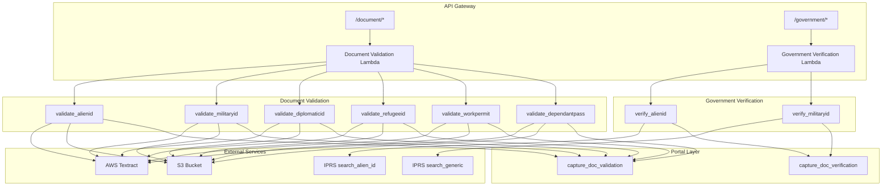

# Design Document: Additional Document Types

## Overview

This design extends the Jubilee eKYC platform to support six additional document types: Alien ID, Military ID, Diplomatic ID, Refugee ID, Work Permit, and Dependant Pass. The implementation follows existing patterns established for National ID, Passport, and KRA PIN Certificate validation/verification.

The design prioritizes:
1. **Alien ID** - Full validation + IPRS verification (ESB method already exists)
2. **Military ID** - Validation + cross-reference verification via linked National ID
3. **Other document types** - Validation only (no IPRS endpoints available)

## Architecture



## Components and Interfaces

### 1. Document Validation Lambda Extensions

**File**: `backend/core/functions/document_validation/src/app.py`

#### New Route Handler

```python
# Add to handler() match statement
case '/document/alienid':
    return validate_alienid(data)
case '/document/militaryid':
    return validate_militaryid(data)
case '/document/diplomaticid':
    return validate_diplomaticid(data)
case '/document/refugeeid':
    return validate_refugeeid(data)
case '/document/workpermit':
    return validate_workpermit(data)
case '/document/dependantpass':
    return validate_dependantpass(data)
```

#### Validation Function Interface

Each validation function follows this pattern:

```python
def validate_<document_type>(data: dict) -> dict:
    """
    Validate document by extracting fields via Textract and comparing with provided data.
    
    Args:
        data: Request body containing:
            - uploadedDocumentUrl: URL to document (S3 or HTTP)
            - <identifier_field>: Primary document identifier
            - <optional_fields>: Additional fields to validate
    
    Returns:
        API Gateway response with:
            - statusCode: 200 on success, 400/500 on error
            - body: {message, s3Path, results: {keywords_checks, matchResults}}
    """
```

### 2. Government Verification Lambda Extensions

**File**: `backend/core/functions/government_verification/src/app.py`

#### New Route Handler

```python
# Add to handler() match statement
case '/government/alienid':
    return verify_alienid(data)
case '/government/militaryid':
    return verify_militaryid(data)
```

#### Verification Function Interface

```python
def verify_alienid(event_data: dict) -> dict:
    """
    Verify Alien ID against IPRS using search_alien_id API.
    
    Args:
        event_data: Request body containing:
            - alienIdNumber: Alien ID number (required)
            - fullNames: Full name to verify
            - dateOfBirth: Date of birth to verify
            - nationality: Nationality to verify
            - gender: Gender to verify
    
    Returns:
        API Gateway response with match results
    """

def verify_militaryid(event_data: dict) -> dict:
    """
    Verify Military ID by cross-referencing with National ID via IPRS.
    
    Args:
        event_data: Request body containing:
            - serviceNumber: Military service number (required)
            - linkedIdNumber: National ID number for IPRS lookup (optional)
            - fullNames: Full name to verify
            - dateOfBirth: Date of birth to verify
    
    Returns:
        API Gateway response with match results
    """
```

### 3. Portal Layer Extensions

**File**: `backend/shared/layers/portal_project/src/portal.py`

```python
class DOCUMENT_TYPE(Enum):
    PASSPORT = "Passport"
    NATIONAL_ID = "NationalID"
    KRA_PIN_CERTIFICATE = "KRAPinCertificate"
    CERTIFICATE_OF_INCORPORATION = "CR12"
    # New document types
    ALIEN_ID = "AlienID"
    MILITARY_ID = "MilitaryID"
    DIPLOMATIC_ID = "DiplomaticID"
    REFUGEE_ID = "RefugeeID"
    WORK_PERMIT = "WorkPermit"
    DEPENDANT_PASS = "DependantPass"
```

### 4. ESB Layer Interface

**File**: `backend/core/layers/jubilee_esb_api_layer/src/iprs.py`

The existing `search_alien_id` method will be used:

```python
def search_alien_id(self, data: Dict) -> Dict:
    """
    Search IPRS using Alien ID number.
    
    Args:
        data: {
            "identifier": "ALIEN_ID",
            "value": "<alien_id_number>"
        }
    
    Returns:
        IPRS response with personal data
    """
```

## Data Models

### Request Schemas

#### Alien ID Validation Request
```json
{
    "type": "object",
    "properties": {
        "uploadedDocumentUrl": {"type": "string", "format": "uri"},
        "alienIdNumber": {"type": "string"},
        "fullNames": {"type": "string"},
        "nationality": {"type": "string"},
        "dateOfBirth": {"type": "string"},
        "dateOfIssue": {"type": "string"},
        "dateOfExpiry": {"type": "string"},
        "gender": {"type": "string"}
    },
    "required": ["uploadedDocumentUrl", "alienIdNumber"]
}
```

#### Military ID Validation Request
```json
{
    "type": "object",
    "properties": {
        "uploadedDocumentUrl": {"type": "string", "format": "uri"},
        "serviceNumber": {"type": "string"},
        "fullNames": {"type": "string"},
        "rank": {"type": "string"},
        "unit": {"type": "string"},
        "dateOfBirth": {"type": "string"},
        "bloodGroup": {"type": "string"}
    },
    "required": ["uploadedDocumentUrl", "serviceNumber"]
}
```

#### Diplomatic ID Validation Request
```json
{
    "type": "object",
    "properties": {
        "uploadedDocumentUrl": {"type": "string", "format": "uri"},
        "diplomaticIdNumber": {"type": "string"},
        "fullNames": {"type": "string"},
        "nationality": {"type": "string"},
        "mission": {"type": "string"},
        "dateOfBirth": {"type": "string"},
        "dateOfIssue": {"type": "string"},
        "dateOfExpiry": {"type": "string"}
    },
    "required": ["uploadedDocumentUrl", "diplomaticIdNumber"]
}
```

#### Refugee ID Validation Request
```json
{
    "type": "object",
    "properties": {
        "uploadedDocumentUrl": {"type": "string", "format": "uri"},
        "refugeeIdNumber": {"type": "string"},
        "fullNames": {"type": "string"},
        "countryOfOrigin": {"type": "string"},
        "dateOfBirth": {"type": "string"},
        "dateOfIssue": {"type": "string"},
        "campSettlement": {"type": "string"}
    },
    "required": ["uploadedDocumentUrl", "refugeeIdNumber"]
}
```

#### Work Permit Validation Request
```json
{
    "type": "object",
    "properties": {
        "uploadedDocumentUrl": {"type": "string", "format": "uri"},
        "permitNumber": {"type": "string"},
        "fullNames": {"type": "string"},
        "nationality": {"type": "string"},
        "employer": {"type": "string"},
        "occupation": {"type": "string"},
        "dateOfIssue": {"type": "string"},
        "dateOfExpiry": {"type": "string"}
    },
    "required": ["uploadedDocumentUrl", "permitNumber"]
}
```

#### Dependant Pass Validation Request
```json
{
    "type": "object",
    "properties": {
        "uploadedDocumentUrl": {"type": "string", "format": "uri"},
        "passNumber": {"type": "string"},
        "fullNames": {"type": "string"},
        "relationship": {"type": "string"},
        "principalPermitNumber": {"type": "string"},
        "dateOfBirth": {"type": "string"},
        "dateOfIssue": {"type": "string"},
        "dateOfExpiry": {"type": "string"}
    },
    "required": ["uploadedDocumentUrl", "passNumber"]
}
```

### Textract Field Mappings

Based on analysis of sample documents, the following Textract field mappings are expected:

| Document Type | Field | Textract Key |
|--------------|-------|--------------|
| Alien ID | Alien ID Number | ALIEN_ID_NUMBER |
| Alien ID | Full Names | FULL_NAMES |
| Alien ID | Nationality | NATIONALITY |
| Alien ID | Date of Birth | DATE_OF_BIRTH |
| Alien ID | Date of Issue | DATE_OF_ISSUE |
| Alien ID | Date of Expiry | DATE_OF_EXPIRY |
| Alien ID | Gender | SEX |
| Military ID | Service Number | SERVICE_NUMBER |
| Military ID | Full Names | FULL_NAMES |
| Military ID | Rank | RANK |
| Military ID | Unit | UNIT |
| Military ID | Date of Birth | DATE_OF_BIRTH |
| Military ID | Blood Group | BLOOD_GROUP |
| Diplomatic ID | Diplomatic ID Number | DIPLOMATIC_ID_NUMBER |
| Diplomatic ID | Full Names | FULL_NAMES |
| Diplomatic ID | Nationality | NATIONALITY |
| Diplomatic ID | Mission | MISSION |
| Refugee ID | Refugee ID Number | REFUGEE_ID_NUMBER |
| Refugee ID | Full Names | FULL_NAMES |
| Refugee ID | Country of Origin | COUNTRY_OF_ORIGIN |
| Refugee ID | Camp/Settlement | CAMP_SETTLEMENT |
| Work Permit | Permit Number | PERMIT_NUMBER |
| Work Permit | Full Names | FULL_NAMES |
| Work Permit | Employer | EMPLOYER |
| Work Permit | Occupation | OCCUPATION |
| Dependant Pass | Pass Number | PASS_NUMBER |
| Dependant Pass | Full Names | FULL_NAMES |
| Dependant Pass | Relationship | RELATIONSHIP |
| Dependant Pass | Principal Permit Number | PRINCIPAL_PERMIT_NUMBER |

**Note**: Actual Textract keys will need to be determined through testing with sample documents. The keys above are initial estimates based on document structure.

### Response Schema

All validation endpoints return:

```json
{
    "statusCode": 200,
    "body": {
        "message": "Validation successful",
        "s3Path": "s3://bucket/AlienID/A123456.pdf",
        "results": {
            "keywords_checks": [
                {"check": "Contains expected keywords", "result": true}
            ],
            "matchResults": {
                "alienIdNumber": {
                    "status": "Matched",
                    "details": {
                        "editdistance": 0,
                        "expected": "A123456",
                        "actual": "A123456",
                        "confidence": 98.5
                    }
                }
            }
        }
    }
}
```


## Correctness Properties

*A property is a characteristic or behavior that should hold true across all valid executions of a system—essentially, a formal statement about what the system should do. Properties serve as the bridge between human-readable specifications and machine-verifiable correctness guarantees.*

### Property 1: Text Normalization Idempotence

*For any* text string, normalizing it once should produce the same result as normalizing it twice. The normalization function (uppercase + trim whitespace) is idempotent.

```python
normalize(normalize(text)) == normalize(text)
```

**Validates: Requirements 1.3, 3.3, 10.1, 10.4**

### Property 2: Date Normalization Equivalence

*For any* valid date represented in different supported formats (DD/MM/YYYY, YYYY-MM-DD, DD-MM-YYYY, "18 May 1987"), parsing should produce equivalent date objects that compare as equal.

```python
parse_date("18/05/1987") == parse_date("1987-05-18") == parse_date("18 May 1987")
```

**Validates: Requirements 2.3, 10.2**

### Property 3: Field Comparison Consistency

*For any* pair of field values (extracted and reference), the comparison result should be deterministic and consistent: if values are equal after normalization, status is "Matched"; if values differ, status is "Not Matched"; if either value is missing, status is "Not Found" or "Not provided".

**Validates: Requirements 2.2, 4.2**

### Property 4: Validation Accuracy Calculation

*For any* set of match results containing N fields with M matches, the validation accuracy should equal `(M / N) * 100` where N excludes fields with "Not Found" or "Not provided" status.

**Validates: Requirements 2.4**

### Property 5: Edit Distance Correctness

*For any* two strings s1 and s2, the calculated Levenshtein distance should satisfy:
- `distance(s1, s1) == 0` (identity)
- `distance(s1, s2) == distance(s2, s1)` (symmetry)
- `distance(s1, s2) >= |len(s1) - len(s2)|` (lower bound)

**Validates: Requirements 10.3**

### Property 6: Response Structure Consistency

*For any* successful validation or verification request, the response body should contain all required fields: `statusCode`, `message`, and `results`. For validation endpoints, `s3Path` should also be present.

**Validates: Requirements 1.4, 3.4, 11.1, 11.2**

### Property 7: Error Response Structure

*For any* failed request (status code 4xx or 5xx), the response body should contain `message` and `error` fields describing the failure.

**Validates: Requirements 11.3**

### Property 8: CORS Headers Presence

*For any* API response (success or error), the response headers should include CORS headers: `Access-Control-Allow-Origin`, `Access-Control-Allow-Headers`, and `Access-Control-Allow-Methods`.

**Validates: Requirements 11.4**

## Error Handling

### Document Download Errors

| Error Condition | Status Code | Error Message |
|----------------|-------------|---------------|
| Invalid URL format | 400 | "Invalid document URL format" |
| Document not found (404) | 400 | "Document not found at provided URL" |
| S3 access denied | 500 | "Error accessing document storage" |
| Download timeout | 500 | "Document download timed out" |

### Document Processing Errors

| Error Condition | Status Code | Error Message |
|----------------|-------------|---------------|
| Unsupported file type | 400 | "Unsupported file type: {type}" |
| PDF conversion failed | 500 | "Error converting document to PDF" |
| Textract extraction failed | 500 | "Error extracting document fields" |

### IPRS Verification Errors

| Error Condition | Status Code | Error Message |
|----------------|-------------|---------------|
| IPRS API timeout | 500 | "IPRS verification timed out" |
| IPRS API error (4xx) | 400 | "IPRS verification failed: {details}" |
| IPRS API error (5xx) | 500 | "IPRS service unavailable" |
| No data returned | 400 | "No IPRS record found for provided identifier" |

### Schema Validation Errors

| Error Condition | Status Code | Error Message |
|----------------|-------------|---------------|
| Missing required field | 400 | "Request body validation failed: {field} is required" |
| Invalid field type | 400 | "Request body validation failed: {field} must be {type}" |
| Invalid URL format | 400 | "Request body validation failed: uploadedDocumentUrl must be a valid URI" |

## Testing Strategy

### Unit Tests

Unit tests should cover:

1. **Schema Validation**
   - Valid request bodies pass validation
   - Missing required fields are rejected
   - Invalid field types are rejected

2. **Field Normalization**
   - Text normalization (uppercase, trim)
   - Date parsing for all supported formats
   - Edge cases (empty strings, None values)

3. **Field Comparison**
   - Exact matches
   - Matches after normalization
   - Non-matches with edit distance calculation
   - Missing field handling

4. **Response Building**
   - Correct status codes
   - Required fields present
   - CORS headers included

5. **Error Handling**
   - Each error condition returns appropriate response

### Property-Based Tests

Property-based tests using Hypothesis library with minimum 100 iterations per test:

```python
from hypothesis import given, strategies as st, settings

@settings(max_examples=100)
@given(st.text(min_size=0, max_size=100))
def test_text_normalization_idempotence(text):
    """
    Feature: additional-document-types, Property 1: Text Normalization Idempotence
    Validates: Requirements 1.3, 3.3, 10.1, 10.4
    """
    normalized = normalize_text(text)
    assert normalize_text(normalized) == normalized
```

```python
@settings(max_examples=100)
@given(st.dates(min_value=date(1900, 1, 1), max_value=date(2100, 12, 31)))
def test_date_normalization_equivalence(d):
    """
    Feature: additional-document-types, Property 2: Date Normalization Equivalence
    Validates: Requirements 2.3, 10.2
    """
    formats = [
        d.strftime("%d/%m/%Y"),
        d.strftime("%Y-%m-%d"),
        d.strftime("%d-%m-%Y"),
        d.strftime("%d %B %Y")
    ]
    parsed_dates = [parse_date(fmt) for fmt in formats]
    assert all(pd == parsed_dates[0] for pd in parsed_dates)
```

```python
@settings(max_examples=100)
@given(st.text(min_size=0, max_size=50), st.text(min_size=0, max_size=50))
def test_edit_distance_properties(s1, s2):
    """
    Feature: additional-document-types, Property 5: Edit Distance Correctness
    Validates: Requirements 10.3
    """
    dist = levenshtein_distance(s1, s2)
    # Identity
    assert levenshtein_distance(s1, s1) == 0
    # Symmetry
    assert levenshtein_distance(s1, s2) == levenshtein_distance(s2, s1)
    # Lower bound
    assert dist >= abs(len(s1) - len(s2))
```

### Integration Tests

Integration tests should verify:

1. **End-to-end validation flow** for each document type
2. **IPRS API integration** for Alien ID and Military ID verification
3. **Portal layer integration** for capturing validation/verification results
4. **S3 document storage** for uploaded documents

### Test Data

Use sample documents from `design and requirements/sample-kyc-documents/`:
- `Sample of Alien ID.pdf`
- `Sample_Military ID 2.pdf`
- `Sample_Diplomatic National ID_1742827485998.pdf`
- `Sample_Refugee ID card.pdf`
- `Sample_work permit.pdf`
- `SAMPLE_ DEPENDANT PASS.pdf`

### Test Configuration

```python
# conftest.py
import pytest
from hypothesis import settings, Phase

# Configure Hypothesis for all property tests
settings.register_profile("ci", max_examples=100, phases=[Phase.generate, Phase.shrink])
settings.register_profile("dev", max_examples=20)
settings.load_profile("ci")

@pytest.fixture
def mock_textract_response():
    """Mock Textract extraction response."""
    return {
        "form": {
            "ALIEN_ID_NUMBER": {"value": "A123456", "confidence": 98.5},
            "FULL_NAMES": {"value": "JOHN DOE", "confidence": 97.2},
            "NATIONALITY": {"value": "INDIAN", "confidence": 96.8}
        },
        "phrases": [{"text": "Republic of Kenya", "confidence": 99.0}]
    }

@pytest.fixture
def mock_iprs_alien_response():
    """Mock IPRS search_alien_id response."""
    return {
        "success": True,
        "error": None,
        "data": {
            "alienIdNumber": "A123456",
            "firstName": "JOHN",
            "surname": "DOE",
            "nationality": "INDIAN",
            "dateOfBirth": "1987-05-18",
            "gender": "M"
        }
    }
```
