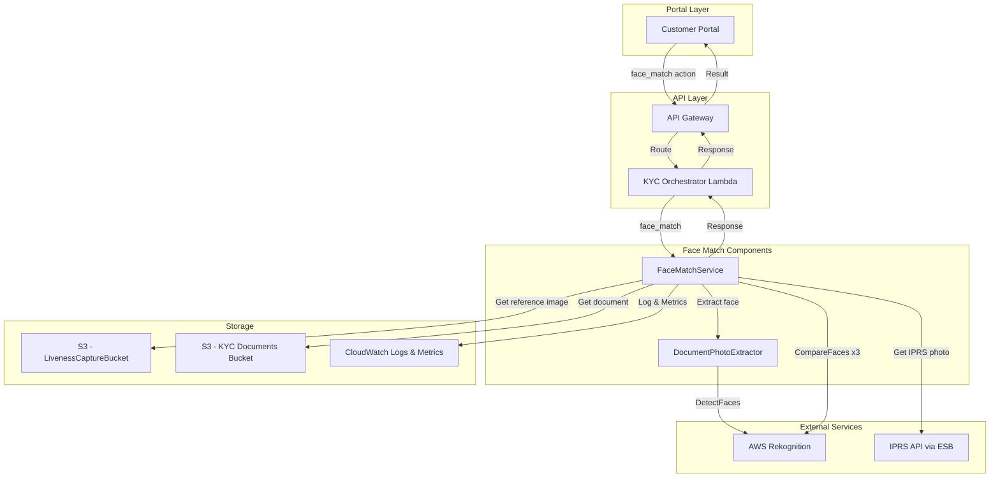
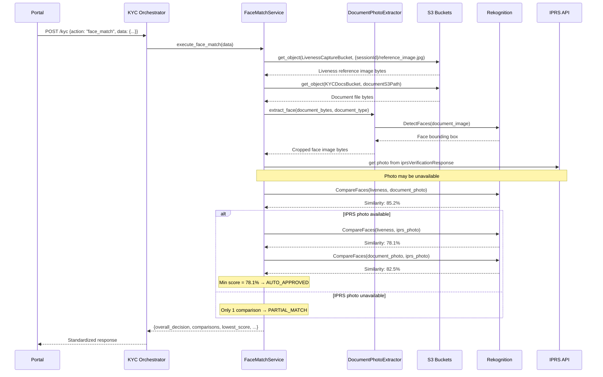

# Design Document: Face Matching Verification

## Overview

The Face Matching Verification feature adds 3-way face comparison to the Jubilee eKYC platform using AWS Rekognition CompareFaces. It compares three face images — a liveness reference image (from an existing face liveness session stored in S3), a document photo (extracted from the uploaded ID document), and an IPRS government photo (base64-encoded from the ESB API) — to verify that the person completing KYC matches both the document and government records.

The feature integrates into the KYC Orchestrator Lambda as a new `face_match` action, following the existing action-based routing pattern. When all three images are available, three pairwise comparisons are performed; when the IPRS photo is unavailable (e.g., Alien ID, Military ID, or missing data), a 2-way comparison is performed and the result is always MANUAL_REVIEW since the verification is inconclusive without the government photo. The minimum similarity score across all comparisons determines the outcome using configurable decision bands (AUTO_APPROVED ≥70%, MANUAL_REVIEW 50–69%, AUTO_REJECTED <50%).

### Key Design Decisions

1. **Integration Point**: Add a new `face_match` action to the KYC Orchestrator rather than creating a separate Lambda. This keeps the routing centralized and reuses existing infrastructure (S3 access, IPRS layer, feature flags).

2. **Fail-Fast Minimum Score Aggregation**: Use the minimum score across all comparisons as the single decision input. This is the most conservative approach — a single weak match pulls the overall decision down, preventing fraud where one image pair matches but another doesn't.

3. **MANUAL_REVIEW for Missing IPRS Photo**: When the IPRS photo is unavailable, the system performs 2-way comparison and returns MANUAL_REVIEW regardless of the 2-way scores. Without the government photo, the verification is inconclusive and requires human review.

4. **Non-Blocking Design**: Face matching errors (Rekognition failures, S3 issues, extraction failures) return structured error responses rather than exceptions, ensuring the overall KYC process continues.

5. **Document Photo Extraction via Rekognition DetectFaces**: Rather than relying on document-type-specific coordinate-based cropping (which is brittle), use Rekognition DetectFaces to locate the face bounding box in any document type, then crop with 20% padding. This approach is document-type-agnostic and handles varying layouts.

## Architecture



### Component Interaction Sequence



## Components and Interfaces

### 1. FaceMatchService

**Location**: `backend/core/functions/kyc_orchestrator/src/face_match_service.py`

**Responsibilities**:
- Orchestrate the full face matching workflow
- Retrieve liveness reference image from S3
- Retrieve and decode IPRS photo from verification response
- Invoke DocumentPhotoExtractor for document face extraction
- Call Rekognition CompareFaces for each comparison pair
- Apply decision algorithm based on minimum score and thresholds
- Return structured result with all comparison details

**Interface**:
```python
from dataclasses import dataclass
from enum import Enum
from typing import Optional, Dict, Any, List

class FaceMatchDecision(Enum):
    AUTO_APPROVED = "AUTO_APPROVED"
    MANUAL_REVIEW = "MANUAL_REVIEW"
    AUTO_REJECTED = "AUTO_REJECTED"
    PARTIAL_MATCH = "PARTIAL_MATCH"

@dataclass
class ComparisonResult:
    pair_name: str          # e.g. "liveness_vs_document"
    similarity: float       # 0.0 - 100.0
    matched: bool           # True if similarity >= auto_approve_threshold
    error: Optional[str] = None

@dataclass
class FaceMatchResult:
    overall_decision: FaceMatchDecision
    comparisons: Dict[str, ComparisonResult]
    lowest_score: Optional[float]
    iprs_photo_available: bool
    document_type: str
    thresholds: Dict[str, float]
    requires_manual_review: bool = False  # True when IPRS photo unavailable (PARTIAL_MATCH)
    error: Optional[str] = None

class FaceMatchService:
    def __init__(
        self,
        rekognition_client,
        s3_client,
        liveness_bucket: str,
        documents_bucket: str,
        auto_approve_threshold: float = 70.0,
        manual_review_threshold: float = 50.0
    ):
        ...

    def execute_face_match(
        self,
        session_id: str,
        document_type: str,
        document_s3_path: str,
        id_number: str,
        iprs_verification_response: Optional[Dict[str, Any]] = None
    ) -> FaceMatchResult:
        """Execute the full face matching workflow."""
        ...

    def compare_faces(
        self,
        source_image: bytes,
        target_image: bytes,
        pair_name: str
    ) -> ComparisonResult:
        """Compare two face images using Rekognition CompareFaces."""
        ...

    def get_liveness_reference_image(self, session_id: str) -> bytes:
        """Retrieve liveness reference image from S3."""
        ...

    def get_iprs_photo(
        self,
        iprs_verification_response: Optional[Dict[str, Any]]
    ) -> Optional[bytes]:
        """Extract and decode IPRS photo from verification response."""
        ...

    def determine_decision(
        self,
        comparisons: List[ComparisonResult],
        iprs_photo_available: bool
    ) -> tuple[FaceMatchDecision, Optional[float]]:
        """Apply decision algorithm based on minimum score."""
        ...
```

### 2. DocumentPhotoExtractor

**Location**: `backend/core/functions/kyc_orchestrator/src/document_photo_extractor.py`

**Responsibilities**:
- Convert PDF documents to images
- Use Rekognition DetectFaces to locate face bounding box
- Crop face region with 20% padding
- Handle different document types

**Interface**:
```python
from typing import Optional

class DocumentPhotoExtractor:
    def __init__(self, rekognition_client):
        ...

    def extract_face(
        self,
        document_bytes: bytes,
        document_type: str
    ) -> bytes:
        """
        Extract face photo from document image.

        Args:
            document_bytes: Raw document file bytes (PDF or image)
            document_type: One of national_id, alien_id, passport, military_id

        Returns:
            Cropped face image bytes (JPEG)

        Raises:
            DocumentPhotoExtractionError: If face cannot be extracted
        """
        ...

    def _convert_pdf_to_image(self, pdf_bytes: bytes) -> bytes:
        """Convert first page of PDF to JPEG image bytes."""
        ...

    def _detect_and_crop_face(
        self,
        image_bytes: bytes,
        padding_percent: float = 0.20
    ) -> bytes:
        """Detect face using Rekognition and crop with padding."""
        ...
```

### 3. Action Router Integration

**Location**: `backend/core/functions/kyc_orchestrator/src/action_router.py`

**Changes**:
- Add `face_match` to `_initialize_action_handlers` mapping
- Add `_handle_face_match` method that instantiates FaceMatchService and delegates
- Add identifier extraction for `face_match` action in `_extract_natural_identifier`

### 4. Payload Schema Addition

**Location**: `backend/core/functions/kyc_orchestrator/src/payload_schemas.py`

**Changes**:
- Add `FACE_MATCH = "face_match"` to `KYCAction` enum
- Add `face_match` data schema to `get_action_data_schemas()`

### 5. Feature Flag Addition

**Location**: `backend/core/functions/kyc_orchestrator/src/feature_flags.py`

**Changes**:
- Add `FACE_MATCH_ACTION = "face_match_action"` to `FeatureFlag` enum
- Add `face_match` mapping in `is_action_enabled`

### 6. Response Normalizer Addition

**Location**: `backend/core/functions/kyc_orchestrator/src/response_normalizer.py`

**Changes**:
- Add `_normalize_face_match` function
- Add `face_match` routing in `normalize_verification_response`
- Add `face_match` mapping in `_action_to_verification_type`

## Data Models

### Request Model

```python
@dataclass
class FaceMatchRequest:
    """Face match action request payload."""
    session_id: str                                    # Liveness session ID
    document_type: str                                 # national_id, alien_id, passport, military_id
    document_s3_path: str                              # S3 key for uploaded document
    id_number: str                                     # Customer ID number
    iprs_verification_response: Optional[Dict] = None  # Previous IPRS verification result
    personal_data: Optional[Dict] = None               # Customer personal data
```

### Response Model

```python
@dataclass
class FaceMatchResponse:
    """Face match action response."""
    overall_decision: str       # AUTO_APPROVED, MANUAL_REVIEW, AUTO_REJECTED, PARTIAL_MATCH
    comparisons: Dict[str, Any] # Per-comparison results
    lowest_score: Optional[float]
    iprs_photo_available: bool
    document_type: str
    thresholds: Dict[str, float]  # {auto_approve: 70, manual_review: 50}
    requires_manual_review: bool  # True when IPRS photo unavailable (PARTIAL_MATCH)

# Example response (3-way, all images available):
{
    "overall_decision": "AUTO_APPROVED",
    "comparisons": {
        "liveness_vs_document": {"similarity": 85.2, "matched": True},
        "liveness_vs_iprs": {"similarity": 78.1, "matched": True},
        "document_vs_iprs": {"similarity": 82.5, "matched": True}
    },
    "lowest_score": 78.1,
    "iprs_photo_available": True,
    "document_type": "national_id",
    "thresholds": {"auto_approve": 70.0, "manual_review": 50.0},
    "requires_manual_review": False
}

# Example response (2-way, IPRS photo unavailable):
{
    "overall_decision": "PARTIAL_MATCH",
    "comparisons": {
        "liveness_vs_document": {"similarity": 85.2, "matched": True}
    },
    "lowest_score": 85.2,
    "iprs_photo_available": False,
    "document_type": "alien_id",
    "thresholds": {"auto_approve": 70.0, "manual_review": 50.0},
    "requires_manual_review": True
}
```

### Internal Models

```python
class DocumentPhotoExtractionError(Exception):
    """Raised when face extraction from document fails."""
    pass

class FaceMatchError(Exception):
    """Raised when face matching encounters a critical error."""
    pass

@dataclass
class ThresholdConfig:
    """Face matching threshold configuration."""
    auto_approve: float = 70.0
    manual_review: float = 50.0
    enabled: bool = True
    require_iprs_photo: bool = False

    def validate(self) -> bool:
        """Return True if thresholds are valid (auto_approve > manual_review)."""
        return self.auto_approve > self.manual_review
```


## Correctness Properties

*A property is a characteristic or behavior that should hold true across all valid executions of a system — essentially, a formal statement about what the system should do. Properties serve as the bridge between human-readable specifications and machine-verifiable correctness guarantees.*

Based on the prework analysis and property reflection, the following consolidated correctness properties have been identified:

### Property 1: S3 Path Construction

*For any* valid session ID string, the constructed S3 key for the liveness reference image SHALL equal `{sessionId}/reference_image.jpg`.

**Validates: Requirements 1.1**

### Property 2: Bounding Box Padding Calculation

*For any* face bounding box within an image of known dimensions, the padded crop region SHALL extend 20% of the bounding box width/height on each side, clamped to the image boundaries (0 ≤ x ≤ width, 0 ≤ y ≤ height), and the resulting crop SHALL always be at least as large as the original bounding box.

**Validates: Requirements 2.4**

### Property 3: Comparison Count Based on IPRS Availability

*For any* face match request, when all three images (liveness, document, IPRS) are available, exactly 3 comparisons SHALL be performed; when the IPRS photo is unavailable (missing from response, Alien ID, or Military ID), exactly 1 comparison SHALL be performed.

**Validates: Requirements 3.3, 3.5, 4.1, 4.2**

### Property 4: Liveness vs Document Comparison Invariant

*For any* successful face match result (regardless of IPRS photo availability or document type), the `liveness_vs_document` comparison SHALL always be present in the comparisons dictionary.

**Validates: Requirements 4.3**

### Property 5: Minimum Score Correctness

*For any* face match result with one or more successful comparisons, the `lowest_score` field SHALL equal the mathematical minimum of all `similarity` values in the comparisons dictionary.

**Validates: Requirements 5.1**

### Property 6: Decision Band Correctness

*For any* set of comparison similarity scores and valid threshold configuration (auto_approve > manual_review), when IPRS photo is available: if the minimum score ≥ auto_approve_threshold then the decision SHALL be AUTO_APPROVED; if the minimum score < manual_review_threshold then the decision SHALL be AUTO_REJECTED; otherwise the decision SHALL be MANUAL_REVIEW.

**Validates: Requirements 5.2, 5.3, 5.4**

### Property 7: PARTIAL_MATCH When IPRS Photo Unavailable

*For any* face match request where the IPRS photo is unavailable, the overall_decision SHALL be PARTIAL_MATCH with `requires_manual_review` set to true, regardless of the similarity scores from the 2-way comparison.

**Validates: Requirements 5.5**

### Property 8: Response Structure Completeness

*For any* face match result, the response SHALL contain all required fields: overall_decision (one of AUTO_APPROVED, MANUAL_REVIEW, AUTO_REJECTED, PARTIAL_MATCH), comparisons (dict), lowest_score (float or None), iprs_photo_available (bool), document_type (string), thresholds (dict with auto_approve and manual_review keys), and requires_manual_review (bool). Each comparison entry SHALL contain similarity (float) and matched (bool) fields.

**Validates: Requirements 4.5, 5.6, 8.1, 8.2, 8.3, 8.4, 8.5**

### Property 9: Non-Blocking Error Handling

*For any* exception raised during face match processing (Rekognition errors, S3 errors, extraction errors), the service SHALL return a structured FaceMatchResult or error dict rather than propagating an unhandled exception.

**Validates: Requirements 9.2, 9.3, 9.5**

### Property 10: Required Payload Field Validation

*For any* face match request payload missing one or more required fields (sessionId, documentType, documentS3Path, idNumber), the payload validation SHALL reject the request.

**Validates: Requirements 7.2, 7.3**

## Error Handling

### Error Categories and Handling

| Error Condition | Response Behavior | Logging Level |
|-----------------|-------------------|---------------|
| Feature disabled (FACE_MATCH_ENABLED=false) | Return disabled status, no comparisons | INFO |
| Liveness image not found in S3 | Return error with "Liveness session image not found" | ERROR |
| S3 connectivity/permission error | Return error with failure details | ERROR |
| No face detected in document | Return error with "No face found in document" | WARNING |
| PDF conversion failure | Return error with "Document format error" | ERROR |
| IPRS photo field missing | Proceed with 2-way comparison, PARTIAL_MATCH + requires_manual_review | INFO |
| IPRS photo base64 decode failure | Proceed with 2-way comparison, log warning | WARNING |
| Rekognition CompareFaces error (single pair) | Mark comparison as failed, continue others | WARNING |
| Rekognition CompareFaces error (all pairs) | Return error response | ERROR |
| Invalid threshold configuration | Use defaults (70/50), log error | ERROR |
| Missing required payload fields | Return 400 validation error | WARNING |
| Unexpected exception | Return structured error, log full traceback | ERROR |

### Graceful Degradation Strategy

1. **IPRS Photo Unavailable**: Fall back to 2-way comparison with PARTIAL_MATCH decision and `requires_manual_review: true` — verification is inconclusive without the government photo
2. **Single Comparison Failure**: Continue with remaining comparisons, exclude failed pair from minimum score calculation
3. **Feature Disabled**: Return immediately with disabled status, zero processing cost
4. **Invalid Thresholds**: Fall back to safe defaults rather than failing

## Testing Strategy

### Dual Testing Approach

This feature requires both unit tests and property-based tests:

- **Unit tests**: Verify specific examples, edge cases, error conditions, integration points, and mocked AWS service interactions
- **Property tests**: Verify universal properties across randomly generated inputs (scores, thresholds, document types, comparison sets)

### Property-Based Testing Configuration

**Library**: `hypothesis` (Python property-based testing library)

**Configuration**:
```python
from hypothesis import settings, Phase

test_settings = settings(
    max_examples=100,
    phases=[Phase.generate, Phase.target, Phase.shrink],
    deadline=None
)
```

**Tagging Convention**: Each property test must include a docstring tag:
```python
def test_property_name():
    """
    Feature: face-matching-verification, Property N: [Property Title]
    Validates: Requirements X.Y
    """
```

**Each correctness property MUST be implemented by a SINGLE property-based test.**

### Test Categories

#### Unit Tests (Specific Examples and Edge Cases)

1. **Liveness Image Retrieval**
   - Successful retrieval from S3
   - S3 NoSuchKey error → error response
   - S3 connectivity error → error response

2. **Document Photo Extraction**
   - PDF document → image conversion
   - JPEG/PNG document → direct processing
   - No face detected → DocumentPhotoExtractionError
   - Corrupted document → error

3. **IPRS Photo Handling**
   - Valid base64 photo → decoded bytes
   - Missing photo field → None, proceed with 2-way
   - Invalid base64 → warning logged, proceed with 2-way
   - National ID → attempt IPRS photo
   - Alien ID → skip IPRS photo

4. **Decision Algorithm Examples**
   - Scores [85, 78, 82] with thresholds 70/50 → AUTO_APPROVED (min=78)
   - Scores [65, 78, 82] with thresholds 70/50 → MANUAL_REVIEW (min=65)
   - Scores [45, 78, 82] with thresholds 70/50 → AUTO_REJECTED (min=45)
   - Score [85] with no IPRS → PARTIAL_MATCH + requires_manual_review
   - Boundary: score exactly 70 → AUTO_APPROVED
   - Boundary: score exactly 50 → MANUAL_REVIEW
   - Boundary: score exactly 49.99 → AUTO_REJECTED

5. **Feature Flag and Configuration**
   - Feature disabled → disabled response
   - Invalid thresholds (approve ≤ review) → defaults used
   - Custom thresholds from env vars

6. **Integration Tests**
   - face_match action registered in ActionRouter
   - Payload validation rejects missing fields
   - Response normalization for face_match
   - Feature flag controls face_match action

#### Property Tests (Universal Properties)

| Property | Test Focus | Generator Strategy |
|----------|------------|-------------------|
| 1 | S3 path construction | Random session ID strings |
| 2 | Bounding box padding | Random bounding boxes within random image dimensions |
| 3 | Comparison count | Random requests with/without IPRS photo |
| 4 | Liveness comparison invariant | Random face match results |
| 5 | Minimum score correctness | Random lists of similarity scores |
| 6 | Decision band correctness | Random scores × random valid thresholds |
| 7 | PARTIAL_MATCH for no IPRS | Random scores with IPRS unavailable |
| 8 | Response structure | Random face match results |
| 9 | Non-blocking errors | Random exception types |
| 10 | Payload validation | Random payloads with missing fields |

### Test Data Generators

```python
from hypothesis import strategies as st

# Similarity scores (0-100)
similarity_score = st.floats(min_value=0.0, max_value=100.0, allow_nan=False, allow_infinity=False)

# Scores in specific decision bands
approve_score = st.floats(min_value=70.0, max_value=100.0, allow_nan=False, allow_infinity=False)
review_score = st.floats(min_value=50.0, max_value=69.99, allow_nan=False, allow_infinity=False)
reject_score = st.floats(min_value=0.0, max_value=49.99, allow_nan=False, allow_infinity=False)

# Valid document types
document_type = st.sampled_from(["national_id", "alien_id", "passport", "military_id"])

# Document types that support IPRS photo
iprs_document_type = st.sampled_from(["national_id", "passport"])
non_iprs_document_type = st.sampled_from(["alien_id", "military_id"])

# Valid threshold configurations (auto_approve > manual_review)
valid_thresholds = st.tuples(
    st.floats(min_value=1.0, max_value=100.0, allow_nan=False, allow_infinity=False),
    st.floats(min_value=0.0, max_value=99.0, allow_nan=False, allow_infinity=False)
).filter(lambda t: t[0] > t[1])

# Session IDs
session_id = st.text(
    alphabet=st.characters(whitelist_categories=('L', 'N'), whitelist_characters='-_'),
    min_size=1, max_size=64
)

# Bounding box within image (left, top, width, height as fractions 0-1)
bounding_box = st.fixed_dictionaries({
    'Left': st.floats(min_value=0.0, max_value=0.8, allow_nan=False, allow_infinity=False),
    'Top': st.floats(min_value=0.0, max_value=0.8, allow_nan=False, allow_infinity=False),
    'Width': st.floats(min_value=0.05, max_value=0.5, allow_nan=False, allow_infinity=False),
    'Height': st.floats(min_value=0.05, max_value=0.5, allow_nan=False, allow_infinity=False),
})

# Image dimensions
image_dimensions = st.tuples(
    st.integers(min_value=100, max_value=4000),  # width
    st.integers(min_value=100, max_value=4000)   # height
)
```

### Mocking Strategy

1. **AWS Rekognition**: Mock `compare_faces` and `detect_faces` responses with configurable similarity scores and bounding boxes
2. **S3**: Mock `get_object` for liveness images and document files
3. **IPRS**: Use the iprsVerificationResponse dict directly (no API call needed — photo comes from previous verification)
4. **Logger**: Mock Lambda Powertools logger to verify log calls and levels

### Coverage Requirements

| Module | Minimum Coverage |
|--------|-----------------|
| face_match_service.py | 90% |
| document_photo_extractor.py | 90% |
| action_router.py (face_match additions) | 85% |
| payload_schemas.py (face_match additions) | 90% |

### Test File Structure

```
backend/core/functions/kyc_orchestrator/tests/
├── __init__.py
├── conftest.py
├── test_face_match_service.py
├── test_property_face_match_service.py
├── test_document_photo_extractor.py
├── test_property_document_photo_extractor.py
└── test_face_match_integration.py
```
