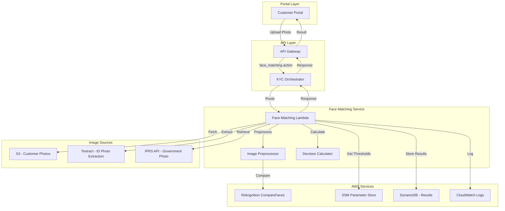
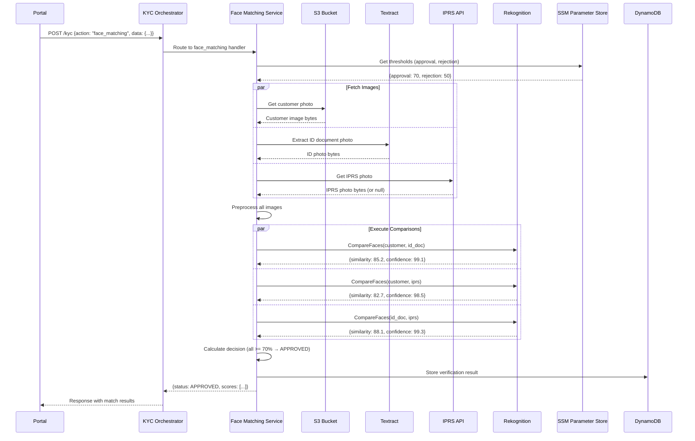

# Design Document: Face Matching Verification

## Overview

The Face Matching Verification feature implements a 3-way face comparison system for the Jubilee eKYC platform. The system compares faces from three sources: customer-uploaded photos, photos extracted from National ID documents, and photos retrieved from the IPRS API. Using AWS Rekognition CompareFaces API, the system performs pairwise comparisons and applies configurable thresholds to determine verification outcomes.

The feature integrates with the existing KYC Orchestrator as a new `face_matching` action, following the established action-based routing pattern. It leverages existing infrastructure including AWS Rekognition (already used for face liveness), Textract (for document processing), and the IPRS API integration.

### Key Design Decisions

1. **Pairwise Comparison Strategy**: Rather than a single multi-face comparison, we perform three pairwise comparisons to get granular similarity scores and identify which specific pair fails if verification is rejected.

2. **Graceful Degradation**: When IPRS photo is unavailable, the system falls back to 2-way comparison with automatic manual review flagging, ensuring the KYC process can continue.

3. **Configurable Thresholds via SSM**: Thresholds are stored in SSM Parameter Store for runtime configurability without code deployment.

4. **Parallel Comparison Execution**: All three comparisons are executed in parallel to meet the <500ms per comparison performance target.

## Architecture



### Component Interaction Sequence



## Components and Interfaces

### 1. Face Matching Lambda Function

**Location**: `backend/core/functions/face_matching/src/app.py`

**Responsibilities**:
- Handle `face_matching` action requests from KYC Orchestrator
- Coordinate image acquisition from multiple sources
- Orchestrate preprocessing and comparison operations
- Apply decision algorithm and return results

**Interface**:
```python
def handler(event: dict, context: LambdaContext) -> dict:
    """
    Main Lambda handler for face matching requests.
    
    Args:
        event: API Gateway event with face matching request
        context: Lambda context
        
    Returns:
        API Gateway response with match results
    """
    pass

def process_face_matching(data: FaceMatchingRequest) -> FaceMatchingResult:
    """
    Process a face matching verification request.
    
    Args:
        data: Request containing customer_id, customer_photo_key, 
              id_document_key, and optional iprs_data
              
    Returns:
        FaceMatchingResult with scores, status, and quality metrics
    """
    pass
```

### 2. Image Preprocessor Module

**Location**: `backend/core/functions/face_matching/src/image_preprocessor.py`

**Responsibilities**:
- Standardize image format (convert to JPEG)
- Resize images while maintaining aspect ratio
- Apply orientation correction using EXIF data
- Calculate quality metrics (brightness, sharpness, face confidence)

**Interface**:
```python
class ImagePreprocessor:
    def preprocess(self, image_bytes: bytes, source_type: str) -> PreprocessedImage:
        """
        Preprocess an image for face comparison.
        
        Args:
            image_bytes: Raw image bytes
            source_type: One of 'customer', 'id_document', 'iprs'
            
        Returns:
            PreprocessedImage with standardized bytes and quality metrics
        """
        pass
    
    def calculate_quality_metrics(self, image_bytes: bytes) -> QualityMetrics:
        """
        Calculate quality metrics for an image.
        
        Returns:
            QualityMetrics with brightness, sharpness, face_confidence scores
        """
        pass
```

### 3. Face Comparator Module

**Location**: `backend/core/functions/face_matching/src/face_comparator.py`

**Responsibilities**:
- Execute Rekognition CompareFaces API calls
- Handle retry logic with exponential backoff
- Validate comparison results

**Interface**:
```python
class FaceComparator:
    def __init__(self, rekognition_client: boto3.client):
        self.client = rekognition_client
        
    def compare_faces(
        self, 
        source_image: bytes, 
        target_image: bytes,
        similarity_threshold: float = 0.0
    ) -> ComparisonResult:
        """
        Compare two face images using Rekognition.
        
        Args:
            source_image: Source face image bytes
            target_image: Target face image bytes
            similarity_threshold: Minimum similarity to return matches
            
        Returns:
            ComparisonResult with similarity score and confidence
            
        Raises:
            NoFaceDetectedError: If no face found in either image
            MultipleFacesError: If multiple faces detected
            ComparisonError: If Rekognition API fails
        """
        pass
    
    async def compare_faces_parallel(
        self,
        comparisons: list[tuple[bytes, bytes, str]]
    ) -> dict[str, ComparisonResult]:
        """
        Execute multiple face comparisons in parallel.
        
        Args:
            comparisons: List of (source, target, comparison_name) tuples
            
        Returns:
            Dict mapping comparison_name to ComparisonResult
        """
        pass
```

### 4. Decision Calculator Module

**Location**: `backend/core/functions/face_matching/src/decision_calculator.py`

**Responsibilities**:
- Apply threshold-based decision logic
- Determine overall match status
- Generate reasons for non-approval outcomes

**Interface**:
```python
class DecisionCalculator:
    def __init__(self, approval_threshold: float, rejection_threshold: float):
        self.approval_threshold = approval_threshold
        self.rejection_threshold = rejection_threshold
        
    def calculate_decision(
        self,
        comparison_results: dict[str, ComparisonResult],
        comparison_mode: str
    ) -> MatchDecision:
        """
        Calculate the overall match decision based on comparison results.
        
        Args:
            comparison_results: Dict of comparison name to result
            comparison_mode: '3-way' or '2-way'
            
        Returns:
            MatchDecision with status, reasons, and detailed breakdown
        """
        pass
```

### 5. Action Router Integration

**Location**: `backend/core/functions/kyc_orchestrator/src/action_router.py`

**Changes Required**:
- Add `face_matching` action to action handlers
- Implement `_handle_face_matching` method

**Interface**:
```python
# Addition to ActionRouter class
def _handle_face_matching(
    self, 
    data: dict, 
    request_context: dict
) -> dict:
    """
    Handle face matching verification action.
    
    Args:
        data: Request data with customer_id, photo references
        request_context: Request context from API Gateway
        
    Returns:
        Standardized response with match results
    """
    pass
```

## Data Models

### Request Models

```python
from dataclasses import dataclass
from typing import Optional
from enum import Enum

class ImageSource(Enum):
    CUSTOMER = "customer"
    ID_DOCUMENT = "id_document"
    IPRS = "iprs"

@dataclass
class FaceMatchingRequest:
    """Request payload for face matching verification."""
    customer_id: str
    customer_photo_key: str  # S3 key for customer uploaded photo
    id_document_key: str     # S3 key for ID document
    iprs_id_number: str      # ID number for IPRS lookup
    request_id: Optional[str] = None

@dataclass
class PreprocessedImage:
    """Preprocessed image ready for comparison."""
    image_bytes: bytes
    source_type: ImageSource
    quality_metrics: 'QualityMetrics'
    original_format: str
    dimensions: tuple[int, int]

@dataclass
class QualityMetrics:
    """Image quality measurements."""
    brightness_score: float      # 0-100
    sharpness_score: float       # 0-100
    face_confidence: float       # 0-100 from Rekognition
    face_bounding_box: dict      # {left, top, width, height}
```

### Response Models

```python
from dataclasses import dataclass
from typing import Optional
from enum import Enum
from datetime import datetime

class MatchStatus(Enum):
    APPROVED = "APPROVED"
    MANUAL_REVIEW = "MANUAL_REVIEW"
    REJECTED = "REJECTED"

class ComparisonMode(Enum):
    THREE_WAY = "3-way"
    TWO_WAY = "2-way"

@dataclass
class ComparisonResult:
    """Result of a single face comparison."""
    comparison_name: str         # e.g., "customer_vs_id_document"
    similarity_score: float      # 0-100
    confidence: float            # 0-100
    source_face_confidence: float
    target_face_confidence: float

@dataclass
class MatchDecision:
    """Overall match decision with reasoning."""
    status: MatchStatus
    reasons: list[str]           # Empty for APPROVED
    comparison_breakdown: dict[str, str]  # comparison_name -> "PASS"/"FAIL"/"REVIEW"

@dataclass
class FaceMatchingResult:
    """Complete face matching verification result."""
    request_id: str
    customer_id: str
    match_status: MatchStatus
    comparison_mode: ComparisonMode
    comparisons: list[ComparisonResult]
    quality_metrics: dict[str, QualityMetrics]  # source_type -> metrics
    decision: MatchDecision
    thresholds_used: dict[str, float]  # approval, rejection thresholds
    timestamp: datetime
    processing_time_ms: float

@dataclass
class FaceMatchingError:
    """Error response for face matching failures."""
    error_code: str
    message: str
    details: Optional[dict] = None
    failed_source: Optional[str] = None  # Which image source failed
```

### DynamoDB Schema

```python
# Face Matching Results Table Schema
{
    "TableName": "FaceMatchingResults",
    "KeySchema": [
        {"AttributeName": "request_id", "KeyType": "HASH"}
    ],
    "GlobalSecondaryIndexes": [
        {
            "IndexName": "customer-index",
            "KeySchema": [
                {"AttributeName": "customer_id", "KeyType": "HASH"},
                {"AttributeName": "timestamp", "KeyType": "RANGE"}
            ]
        }
    ],
    "AttributeDefinitions": [
        {"AttributeName": "request_id", "AttributeType": "S"},
        {"AttributeName": "customer_id", "AttributeType": "S"},
        {"AttributeName": "timestamp", "AttributeType": "S"}
    ]
}

# Item Structure
{
    "request_id": "uuid-string",
    "customer_id": "customer-uuid",
    "timestamp": "2024-01-15T10:30:00Z",
    "match_status": "APPROVED",
    "comparison_mode": "3-way",
    "comparisons": {
        "customer_vs_id_document": {
            "similarity_score": 85.2,
            "confidence": 99.1
        },
        "customer_vs_iprs": {
            "similarity_score": 82.7,
            "confidence": 98.5
        },
        "id_document_vs_iprs": {
            "similarity_score": 88.1,
            "confidence": 99.3
        }
    },
    "quality_metrics": {
        "customer": {"brightness": 75, "sharpness": 82, "face_confidence": 99.5},
        "id_document": {"brightness": 68, "sharpness": 71, "face_confidence": 98.2},
        "iprs": {"brightness": 70, "sharpness": 75, "face_confidence": 97.8}
    },
    "thresholds": {
        "approval": 70,
        "rejection": 50
    },
    "image_references": {
        "customer_photo": "s3://bucket/customer/photo.jpg",
        "id_document": "s3://bucket/documents/id.pdf",
        "iprs_reference": "iprs:12345678"
    },
    "processing_time_ms": 1250,
    "ttl": 1705312200  # 30 days retention
}
```


## Correctness Properties

*A property is a characteristic or behavior that should hold true across all valid executions of a system—essentially, a formal statement about what the system should do. Properties serve as the bridge between human-readable specifications and machine-verifiable correctness guarantees.*

Based on the prework analysis of acceptance criteria, the following correctness properties have been identified for property-based testing:

### Property 1: Image Validation Correctness

*For any* customer photo input, the validation function SHALL correctly accept images that meet all quality requirements (resolution ≥ 480x480, format in {JPEG, PNG}, exactly one face detected) and reject images that fail any requirement, returning specific quality issues for rejected images.

**Validates: Requirements 1.1, 1.4**

### Property 2: IPRS Photo Extraction

*For any* valid IPRS API response containing a photo field, the extraction function SHALL correctly retrieve the photo bytes; for any response missing the photo field, the function SHALL return null to trigger 2-way fallback mode.

**Validates: Requirements 1.3**

### Property 3: Graceful Degradation to 2-Way Mode

*For any* face matching request where IPRS photo is unavailable, the system SHALL execute only the Customer ↔ ID Document comparison, return exactly one comparison result, set comparison_mode to "2-way", and set Match_Status to MANUAL_REVIEW regardless of the similarity score (if above rejection threshold).

**Validates: Requirements 1.6, 3.5, 4.4**

### Property 4: Image Format Standardization

*For any* input image in a supported format (JPEG, PNG), the Image_Preprocessor SHALL output a valid JPEG image that can be successfully decoded.

**Validates: Requirements 2.1**

### Property 5: Aspect Ratio Preservation

*For any* input image with dimensions (w, h), after preprocessing the output image dimensions (w', h') SHALL satisfy: |w/h - w'/h'| < 0.01 (aspect ratio preserved within 1% tolerance).

**Validates: Requirements 2.2**

### Property 6: Quality Metrics Completeness

*For any* successfully preprocessed image, the returned QualityMetrics SHALL contain brightness_score, sharpness_score, and face_confidence, all within the range [0, 100].

**Validates: Requirements 2.5**

### Property 7: Comparison Completeness

*For any* face matching request with all three images available (customer, ID document, IPRS), the system SHALL return exactly three comparison results: customer_vs_id_document, customer_vs_iprs, and id_document_vs_iprs, each with a similarity_score and confidence value.

**Validates: Requirements 3.1, 3.2, 3.3, 3.4**

### Property 8: Decision Algorithm - Approval

*For any* set of comparison results where ALL similarity scores are ≥ approval_threshold, the DecisionCalculator SHALL return Match_Status = APPROVED with an empty reasons array.

**Validates: Requirements 4.1**

### Property 9: Decision Algorithm - Manual Review

*For any* set of comparison results where at least one similarity score is in the range [rejection_threshold, approval_threshold) and no score is below rejection_threshold, the DecisionCalculator SHALL return Match_Status = MANUAL_REVIEW with a non-empty reasons array identifying the borderline comparisons.

**Validates: Requirements 4.2**

### Property 10: Decision Algorithm - Rejection

*For any* set of comparison results where at least one similarity score is < rejection_threshold, the DecisionCalculator SHALL return Match_Status = REJECTED with a non-empty reasons array identifying the failed comparisons.

**Validates: Requirements 4.3**

### Property 11: Response Structure Completeness

*For any* successful face matching operation, the response SHALL contain: match_status (one of APPROVED, MANUAL_REVIEW, REJECTED), comparison_mode (one of "3-way", "2-way"), an array of comparisons each with similarity_score and confidence, and quality_metrics for each input image source.

**Validates: Requirements 5.1, 5.2, 5.3, 5.4, 5.5**

### Property 12: Reasons for Non-Approval

*For any* face matching result where Match_Status is MANUAL_REVIEW or REJECTED, the response SHALL contain a non-empty reasons array with at least one string explaining which comparison(s) triggered the status.

**Validates: Requirements 5.6**

### Property 13: Audit Trail Storage

*For any* completed face matching operation (success or failure), the stored DynamoDB record SHALL contain: request_id, customer_id, timestamp, match_status, all comparison scores, thresholds used, and S3 references to images (not image bytes).

**Validates: Requirements 6.3, 7.4**

### Property 14: KYC Status Update Consistency

*For any* face matching result, the customer's KYC status in DynamoDB SHALL be updated to reflect the match outcome: APPROVED → "Verified", MANUAL_REVIEW → "PendingReview", REJECTED → "Failed".

**Validates: Requirements 6.4**

### Property 15: Error Response Format

*For any* error condition (no face detected, multiple faces, unsupported format, API failure), the error response SHALL contain error_code (matching the specific error type), message (human-readable description), and failed_source (identifying which image caused the error when applicable).

**Validates: Requirements 6.5, 8.2, 8.3, 8.4**

### Property 16: Retry Behavior

*For any* Rekognition API call that fails with a retryable error, the system SHALL retry exactly once with exponential backoff before returning an error; if the retry succeeds, the comparison result SHALL be returned normally.

**Validates: Requirements 8.1**

### Property 17: Input Validation

*For any* face matching request with invalid input parameters (missing required fields, invalid formats, empty values), the system SHALL return a validation error response with field-level details identifying each invalid field and the specific validation failure.

**Validates: Requirements 8.6**

## Error Handling

### Error Categories and Codes

| Error Code | Category | Description | HTTP Status |
|------------|----------|-------------|-------------|
| `VALIDATION_ERROR` | Input | Request payload validation failed | 400 |
| `NO_FACE_DETECTED` | Image | No face found in source image | 400 |
| `MULTIPLE_FACES_DETECTED` | Image | More than one face in source image | 400 |
| `UNSUPPORTED_FORMAT` | Image | Image format not supported | 400 |
| `IMAGE_TOO_SMALL` | Image | Image resolution below minimum | 400 |
| `PREPROCESSING_FAILED` | Processing | Image preprocessing error | 500 |
| `COMPARISON_FAILED` | Processing | Rekognition API error | 500 |
| `IPRS_UNAVAILABLE` | External | IPRS API not responding | 503 |
| `TEXTRACT_FAILED` | External | Document photo extraction failed | 500 |
| `SSM_UNAVAILABLE` | Config | Cannot read thresholds (uses defaults) | N/A |
| `TIMEOUT` | Processing | Operation exceeded time limit | 504 |
| `STORAGE_FAILED` | Storage | DynamoDB write failed | 500 |

### Error Response Structure

```python
{
    "success": False,
    "action": "face_matching",
    "error": {
        "error_code": "NO_FACE_DETECTED",
        "message": "No face detected in the customer photo",
        "details": {
            "failed_source": "customer",
            "suggestion": "Please upload a clear photo with your face visible"
        }
    },
    "timestamp": "2024-01-15T10:30:00Z",
    "request_id": "uuid-string"
}
```

### Retry Strategy

```python
RETRY_CONFIG = {
    "max_retries": 1,
    "base_delay_ms": 100,
    "max_delay_ms": 1000,
    "retryable_errors": [
        "ThrottlingException",
        "ProvisionedThroughputExceededException",
        "ServiceUnavailableException"
    ]
}
```

### Graceful Degradation Scenarios

1. **IPRS Unavailable**: Continue with 2-way comparison, flag for manual review
2. **SSM Unavailable**: Use default thresholds (70% approval, 50% rejection)
3. **Partial Timeout**: Return completed comparisons with timeout indicator
4. **DynamoDB Write Failure**: Log error, return success to client (audit gap acceptable)

## Testing Strategy

### Dual Testing Approach

This feature requires both unit tests and property-based tests for comprehensive coverage:

- **Unit Tests**: Verify specific examples, edge cases, integration points, and error conditions
- **Property Tests**: Verify universal properties across randomly generated inputs

### Property-Based Testing Configuration

**Library**: `hypothesis` (Python property-based testing library)

**Configuration**:
```python
from hypothesis import settings, Phase

# Minimum 100 iterations per property test
test_settings = settings(
    max_examples=100,
    phases=[Phase.generate, Phase.target, Phase.shrink],
    deadline=None  # Disable deadline for API-dependent tests
)
```

**Tagging Convention**: Each property test must include a docstring tag:
```python
def test_property_name():
    """
    Feature: face-matching-verification, Property N: [Property Title]
    Validates: Requirements X.Y
    """
```

### Test Categories

#### Unit Tests (Specific Examples)

1. **Image Validation**
   - Valid JPEG 640x480 with single face → Accept
   - PNG 1920x1080 with single face → Accept
   - JPEG 320x240 (too small) → Reject with IMAGE_TOO_SMALL
   - Image with no face → Reject with NO_FACE_DETECTED
   - Image with 3 faces → Reject with MULTIPLE_FACES_DETECTED

2. **Decision Algorithm Edge Cases**
   - All scores exactly at 70% threshold → APPROVED
   - One score at 69.9%, others at 90% → MANUAL_REVIEW
   - One score at 49.9%, others at 90% → REJECTED
   - 2-way mode with 95% score → MANUAL_REVIEW (not APPROVED)

3. **Integration Points**
   - KYC Orchestrator routes `face_matching` action correctly
   - DynamoDB record contains all required fields
   - SSM parameter retrieval with fallback

#### Property Tests (Universal Properties)

Each correctness property (1-17) maps to a property-based test:

| Property | Test Focus | Generator Strategy |
|----------|------------|-------------------|
| 1 | Image validation | Random images with varying resolution, format, face count |
| 2 | IPRS extraction | Random IPRS response structures |
| 3 | 2-way fallback | Requests with/without IPRS photo |
| 4 | Format standardization | Random supported image formats |
| 5 | Aspect ratio | Random image dimensions |
| 6 | Quality metrics | Random preprocessed images |
| 7 | Comparison completeness | Requests with all 3 images |
| 8 | Approval decision | Random scores all ≥ threshold |
| 9 | Review decision | Random scores with one in review range |
| 10 | Rejection decision | Random scores with one below threshold |
| 11 | Response structure | Random successful operations |
| 12 | Non-approval reasons | Random non-approved results |
| 13 | Audit storage | Random completed operations |
| 14 | KYC status update | Random match results |
| 15 | Error format | Random error conditions |
| 16 | Retry behavior | Simulated transient failures |
| 17 | Input validation | Random invalid inputs |

### Test Data Generators

```python
from hypothesis import strategies as st

# Generate random similarity scores
similarity_score = st.floats(min_value=0.0, max_value=100.0)

# Generate scores that should result in APPROVED
approved_scores = st.lists(
    st.floats(min_value=70.0, max_value=100.0),
    min_size=3, max_size=3
)

# Generate scores that should result in MANUAL_REVIEW
review_scores = st.lists(
    st.floats(min_value=50.0, max_value=100.0),
    min_size=3, max_size=3
).filter(lambda scores: any(50.0 <= s < 70.0 for s in scores))

# Generate scores that should result in REJECTED
rejected_scores = st.lists(
    st.floats(min_value=0.0, max_value=100.0),
    min_size=3, max_size=3
).filter(lambda scores: any(s < 50.0 for s in scores))

# Generate image dimensions
image_dimensions = st.tuples(
    st.integers(min_value=100, max_value=4000),
    st.integers(min_value=100, max_value=4000)
)

# Generate quality metrics
quality_metrics = st.fixed_dictionaries({
    'brightness_score': st.floats(min_value=0.0, max_value=100.0),
    'sharpness_score': st.floats(min_value=0.0, max_value=100.0),
    'face_confidence': st.floats(min_value=0.0, max_value=100.0)
})
```

### Mocking Strategy

For property tests involving external services:

1. **Rekognition**: Mock `compare_faces` to return deterministic scores based on input hash
2. **Textract**: Mock `analyze_id` to return predefined photo regions
3. **IPRS**: Mock API responses with/without photo field
4. **SSM**: Mock parameter retrieval with configurable values
5. **DynamoDB**: Use moto library for local DynamoDB simulation

### Coverage Requirements

- Minimum 80% code coverage for face matching module
- 100% coverage of decision algorithm branches
- All 17 correctness properties must have passing property tests
- All error codes must have at least one unit test
