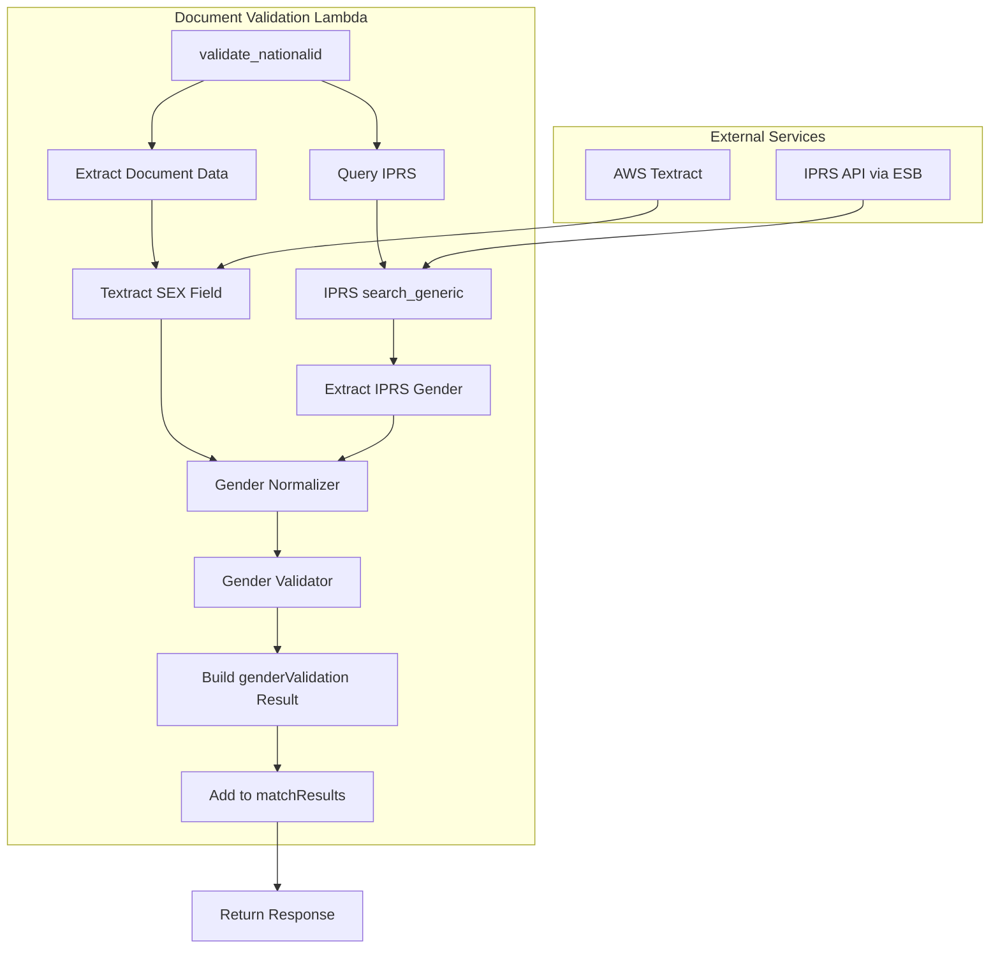

# Design Document: Gender Validation via IPRS

## Overview

This design describes the implementation of gender validation by cross-referencing gender data extracted from National ID documents against authoritative IPRS (Integrated Population Registration System) data. The feature integrates into the existing document validation workflow with minimal overhead (<50ms) and provides structured validation results for downstream processing.

The design leverages existing infrastructure:
- AWS Textract for document extraction (already extracting SEX field)
- IPRS API integration via ESB layer (already operational)
- Document validation Lambda function (enhancement target)

## Architecture



### Data Flow

1. Document validation receives National ID with uploaded document URL
2. Textract extracts SEX field from document (existing flow)
3. IPRS is queried using ID number (existing flow for other fields)
4. Gender Normalizer standardizes both gender values
5. Gender Validator compares normalized values
6. Result is added to matchResults structure
7. Response includes genderValidation object

## Components and Interfaces

### Gender Normalizer

**Location**: `backend/core/functions/document_validation/src/gender_utils.py` (new file)

```python
from typing import Optional
from aws_lambda_powertools import Logger

logger = Logger()

# Mapping of gender variations to standard codes
GENDER_MAPPINGS = {
    # Male variations
    'M': 'M',
    'MALE': 'M',
    'm': 'M',
    'male': 'M',
    'Male': 'M',
    # Female variations
    'F': 'F',
    'FEMALE': 'F',
    'f': 'F',
    'female': 'F',
    'Female': 'F',
}


def normalize_gender(gender_value: Optional[str]) -> Optional[str]:
    """
    Normalize gender value to standard M/F code.
    
    Args:
        gender_value: Raw gender string from document or IPRS
        
    Returns:
        'M', 'F', or None if unrecognized/missing
    """
    if gender_value is None:
        return None
    
    # Strip whitespace
    cleaned = gender_value.strip()
    
    if not cleaned:
        return None
    
    # Look up in mappings
    normalized = GENDER_MAPPINGS.get(cleaned)
    
    if normalized is None:
        logger.warning(f"Unrecognized gender value: {cleaned}")
        
    return normalized
```

### Gender Validator

**Location**: `backend/core/functions/document_validation/src/gender_utils.py` (same file)

```python
from typing import Dict, Any, Optional
from enum import Enum


class GenderValidationStatus(str, Enum):
    MATCH = "MATCH"
    MISMATCH = "MISMATCH"
    INCONCLUSIVE = "INCONCLUSIVE"


def validate_gender(
    document_gender: Optional[str],
    iprs_gender: Optional[str]
) -> Dict[str, Any]:
    """
    Compare normalized gender values and return validation result.
    
    Args:
        document_gender: Normalized gender from document (M/F/None)
        iprs_gender: Normalized gender from IPRS (M/F/None)
        
    Returns:
        genderValidation object with status, values, and reason
    """
    result = {
        'extractedGender': document_gender,
        'iprsGender': iprs_gender,
        'normalizedComparison': None,
        'status': None,
        'reason': None
    }
    
    # Check for missing data
    if document_gender is None and iprs_gender is None:
        result['status'] = GenderValidationStatus.INCONCLUSIVE.value
        result['reason'] = "Gender unavailable from both document and IPRS"
        return result
    
    if document_gender is None:
        result['status'] = GenderValidationStatus.INCONCLUSIVE.value
        result['reason'] = "Gender not extracted from document"
        return result
    
    if iprs_gender is None:
        result['status'] = GenderValidationStatus.INCONCLUSIVE.value
        result['reason'] = "Gender not available from IPRS"
        return result
    
    # Both values available - compare
    if document_gender == iprs_gender:
        result['status'] = GenderValidationStatus.MATCH.value
        result['normalizedComparison'] = True
    else:
        result['status'] = GenderValidationStatus.MISMATCH.value
        result['normalizedComparison'] = False
        result['reason'] = f"Document gender ({document_gender}) differs from IPRS gender ({iprs_gender})"
    
    return result
```

### Integration Interface

**Location**: `backend/core/functions/document_validation/src/app.py` (modification)

```python
def perform_gender_validation(
    extracted_form: Dict[str, Any],
    iprs_response: Optional[Dict[str, Any]]
) -> Dict[str, Any]:
    """
    Perform gender validation using document and IPRS data.
    
    Args:
        extracted_form: Textract extraction results containing SEX field
        iprs_response: IPRS API response containing gender field
        
    Returns:
        genderValidation result object
    """
    from gender_utils import normalize_gender, validate_gender
    
    # Extract document gender
    doc_gender_raw = None
    if 'SEX' in extracted_form and extracted_form['SEX'].get('value'):
        doc_gender_raw = extracted_form['SEX']['value']
    
    # Extract IPRS gender
    iprs_gender_raw = None
    if iprs_response and 'data' in iprs_response:
        iprs_gender_raw = iprs_response['data'].get('gender')
    
    # Normalize both values
    doc_gender_normalized = normalize_gender(doc_gender_raw)
    iprs_gender_normalized = normalize_gender(iprs_gender_raw)
    
    # Validate
    return validate_gender(doc_gender_normalized, iprs_gender_normalized)
```

## Data Models

### Gender Validation Result

```python
@dataclass
class GenderValidationResult:
    """Result of gender validation between document and IPRS."""
    
    status: str  # "MATCH", "MISMATCH", or "INCONCLUSIVE"
    extractedGender: Optional[str]  # Normalized document gender (M/F/None)
    iprsGender: Optional[str]  # Normalized IPRS gender (M/F/None)
    normalizedComparison: Optional[bool]  # True if match, False if mismatch, None if inconclusive
    reason: Optional[str]  # Explanation for non-MATCH status
```

### JSON Response Structure

```json
{
  "genderValidation": {
    "status": "MATCH | MISMATCH | INCONCLUSIVE",
    "extractedGender": "M | F | null",
    "iprsGender": "M | F | null",
    "normalizedComparison": true | false | null,
    "reason": "string | null"
  }
}
```

### Integration with Existing matchResults

The genderValidation object will be added to the existing matchResults structure:

```json
{
  "matchResults": {
    "serialNumber": { "status": "Matched", "details": {...} },
    "idNumber": { "status": "Matched", "details": {...} },
    "fullNames": { "status": "Matched", "details": {...} },
    "dateOfBirth": { "status": "Matched", "details": {...} },
    "dateOfIssue": { "status": "Matched", "details": {...} },
    "gender": { "status": "Matched", "details": {...} },
    "districtOfBirth": { "status": "Matched", "details": {...} },
    "placeOfIssue": { "status": "Matched", "details": {...} },
    "genderValidation": {
      "status": "MATCH",
      "extractedGender": "M",
      "iprsGender": "M",
      "normalizedComparison": true,
      "reason": null
    }
  }
}
```


## Correctness Properties

*A property is a characteristic or behavior that should hold true across all valid executions of a system—essentially, a formal statement about what the system should do. Properties serve as the bridge between human-readable specifications and machine-verifiable correctness guarantees.*

Based on the acceptance criteria analysis, the following properties have been identified for property-based testing:

### Property 1: Gender Normalization Correctness

*For any* valid gender string from the set {"M", "MALE", "m", "male", "Male", "F", "FEMALE", "f", "female", "Female"}, the Gender_Normalizer SHALL return the correct standard code ("M" for male variants, "F" for female variants).

**Validates: Requirements 1.2, 1.3, 2.3**

### Property 2: Invalid Gender Returns Null

*For any* string that is not in the set of valid gender variations, the Gender_Normalizer SHALL return null.

**Validates: Requirements 1.4**

### Property 3: Validation Status Reflects Equality

*For any* two non-null normalized gender values, the Gender_Validator SHALL return status MATCH if and only if the values are equal, and status MISMATCH if and only if the values differ.

**Validates: Requirements 3.1, 3.2**

### Property 4: Null Input Produces INCONCLUSIVE

*For any* input where at least one of document_gender or iprs_gender is null, the Gender_Validator SHALL return status INCONCLUSIVE.

**Validates: Requirements 3.3**

### Property 5: Non-MATCH Status Includes Reason

*For any* validation result where status is MISMATCH or INCONCLUSIVE, the reason field SHALL be non-null and non-empty.

**Validates: Requirements 3.4, 3.5, 4.6**

### Property 6: Result Structure Completeness

*For any* inputs to the Gender_Validator, the result SHALL contain all required fields: status, extractedGender, iprsGender, normalizedComparison, and reason.

**Validates: Requirements 4.1, 4.3, 4.4**

### Property 7: NormalizedComparison Consistency

*For any* validation result, the normalizedComparison field SHALL be true when status is MATCH, false when status is MISMATCH, and null when status is INCONCLUSIVE.

**Validates: Requirements 4.5**

## Error Handling

### Normalization Errors

| Scenario | Handling | Result |
|----------|----------|--------|
| Null input | Return null | No error logged |
| Empty string | Return null | No error logged |
| Whitespace only | Return null after strip | No error logged |
| Unrecognized value | Return null | Log WARNING with original value |

### IPRS API Errors

| Scenario | Handling | Result |
|----------|----------|--------|
| API timeout | Catch exception, log ERROR | IPRS gender = null, status = INCONCLUSIVE |
| API error response (4xx/5xx) | Log ERROR with status code | IPRS gender = null, status = INCONCLUSIVE |
| Missing gender field in response | No error | IPRS gender = null, status = INCONCLUSIVE |
| Malformed response | Catch exception, log ERROR | IPRS gender = null, status = INCONCLUSIVE |

### Validation Errors

| Scenario | Handling | Result |
|----------|----------|--------|
| Exception during validation | Catch, log ERROR with stack trace | Return INCONCLUSIVE with error reason |
| Unexpected status | Should not occur (enum enforced) | N/A |

### Non-Blocking Behavior

Gender validation is designed to be non-blocking:

```python
def validate_nationalid(data):
    # ... existing validation logic ...
    
    # Gender validation - wrapped in try/except to ensure non-blocking
    try:
        gender_validation_result = perform_gender_validation(
            extracted_form, 
            iprs_response
        )
        logger.info(f"Gender validation completed: {gender_validation_result['status']}")
    except Exception as e:
        logger.error(f"Gender validation failed with exception: {e}", exc_info=True)
        gender_validation_result = {
            'status': 'INCONCLUSIVE',
            'extractedGender': None,
            'iprsGender': None,
            'normalizedComparison': None,
            'reason': f'Validation error: {str(e)}'
        }
    
    # Add to matchResults regardless of outcome
    matchResults['genderValidation'] = gender_validation_result
    
    # ... continue with remaining validation logic ...
```

## Testing Strategy

### Property-Based Testing

Property-based tests will be implemented using **Hypothesis** (Python's property-based testing library) to validate the correctness properties defined above.

**Configuration**:
- Minimum 100 iterations per property test
- Each test tagged with feature and property reference

**Test File**: `backend/core/functions/document_validation/tests/test_gender_validation_properties.py`

```python
from hypothesis import given, strategies as st, settings

# Feature: gender-validation-iprs, Property 1: Gender Normalization Correctness
@settings(max_examples=100)
@given(st.sampled_from(['M', 'MALE', 'm', 'male', 'Male']))
def test_male_normalization(gender_input):
    """Property 1: Male variants normalize to 'M'"""
    assert normalize_gender(gender_input) == 'M'

# Feature: gender-validation-iprs, Property 2: Invalid Gender Returns Null
@settings(max_examples=100)
@given(st.text().filter(lambda x: x.strip() not in GENDER_MAPPINGS))
def test_invalid_gender_returns_null(invalid_input):
    """Property 2: Invalid inputs return null"""
    assert normalize_gender(invalid_input) is None
```

### Unit Testing

Unit tests complement property tests by covering:

1. **Specific Examples**: Known input/output pairs
2. **Edge Cases**: Empty strings, whitespace, None values
3. **Integration Points**: IPRS response parsing, matchResults structure

**Test File**: `backend/core/functions/document_validation/tests/test_gender_validation.py`

**Example Unit Tests**:
- `test_normalize_gender_male_uppercase` - "M" → "M"
- `test_normalize_gender_female_lowercase` - "female" → "F"
- `test_normalize_gender_none_input` - None → None
- `test_validate_gender_match` - ("M", "M") → MATCH
- `test_validate_gender_mismatch` - ("M", "F") → MISMATCH
- `test_validate_gender_inconclusive_doc_null` - (None, "M") → INCONCLUSIVE
- `test_validate_gender_inconclusive_iprs_null` - ("F", None) → INCONCLUSIVE
- `test_validate_gender_inconclusive_both_null` - (None, None) → INCONCLUSIVE
- `test_perform_gender_validation_integration` - Full flow with mock data

### Test Coverage Requirements

| Component | Coverage Target |
|-----------|-----------------|
| gender_utils.py | 100% |
| Gender validation in app.py | 90%+ |
| Error handling paths | 100% |

### Performance Testing

While not property-tested, performance should be validated:
- Gender validation overhead < 50ms
- No additional API calls beyond existing IPRS query
- Memory usage within Lambda limits
