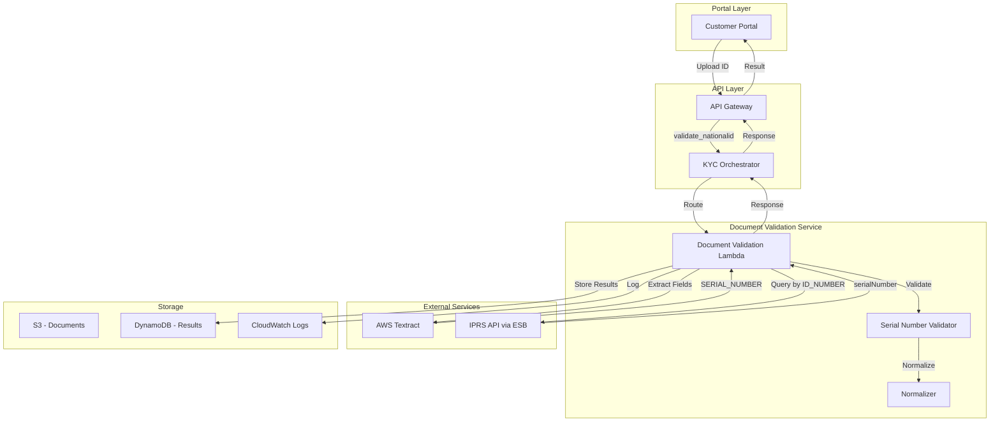
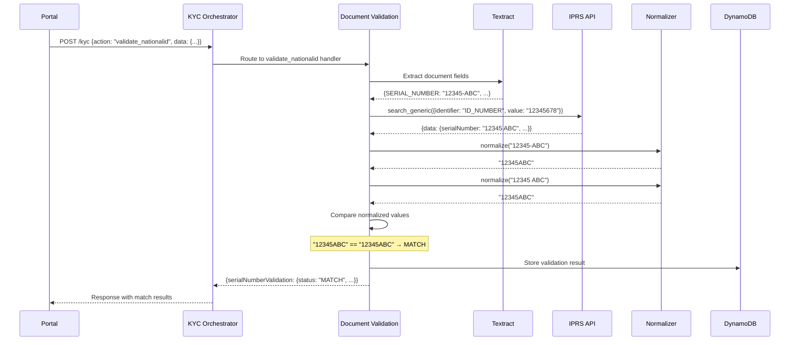

# Design Document: Serial Number Validation

## Overview

The Serial Number Validation feature enhances the Jubilee eKYC platform's National ID verification by comparing the serial number extracted from submitted ID documents against the latest serial number from the IPRS (Integrated Population Registration System) API. This validation detects counterfeit or outdated ID documents, as Kenya issues new serial numbers when IDs are replaced.

The feature integrates into the existing `validate_nationalid` action in the Document Validation Lambda function. It leverages the existing Textract extraction (SERIAL_NUMBER field) and IPRS API integration (`search_generic` method) to minimize new infrastructure while adding a critical fraud detection capability.

### Key Design Decisions

1. **Integration Point**: Enhance the existing `validate_nationalid` function rather than creating a new Lambda, reducing deployment complexity and maintaining the current API contract.

2. **Normalization Strategy**: Apply consistent normalization (uppercase, remove spaces/hyphens/dots) to both serial numbers before comparison to handle formatting variations between document OCR and IPRS data.

3. **Non-Blocking Validation**: Serial number validation failures (INCONCLUSIVE) do not block the overall KYC process, allowing other validations to proceed while flagging the serial number issue.

4. **Three-State Outcome**: Use MATCH/MISMATCH/INCONCLUSIVE rather than binary pass/fail to distinguish between confirmed fraud indicators and data availability issues.

## Architecture



### Component Interaction Sequence



## Components and Interfaces

### 1. Serial Number Validator Module

**Location**: `backend/core/functions/document_validation/src/serial_number_validator.py`

**Responsibilities**:
- Coordinate serial number extraction and comparison
- Apply normalization rules
- Determine validation status
- Generate detailed validation results

**Interface**:
```python
from dataclasses import dataclass
from enum import Enum
from typing import Optional

class ValidationStatus(Enum):
    MATCH = "MATCH"
    MISMATCH = "MISMATCH"
    INCONCLUSIVE = "INCONCLUSIVE"

@dataclass
class SerialNumberValidationResult:
    status: ValidationStatus
    extracted_serial_number: Optional[str]
    iprs_serial_number: Optional[str]
    normalized_comparison: bool
    reason: Optional[str] = None

def validate_serial_number(
    extracted_serial: Optional[str],
    iprs_serial: Optional[str]
) -> SerialNumberValidationResult:
    """
    Validate serial number by comparing document extraction with IPRS data.
    
    Args:
        extracted_serial: Serial number extracted from document via Textract
        iprs_serial: Serial number from IPRS API response
        
    Returns:
        SerialNumberValidationResult with status and details
    """
    pass
```

### 2. Normalizer Module

**Location**: `backend/core/functions/document_validation/src/normalizer.py`

**Responsibilities**:
- Standardize serial number format
- Remove formatting characters (spaces, hyphens, dots)
- Convert to uppercase
- Handle edge cases (None, empty strings)

**Interface**:
```python
def normalize_serial_number(serial: Optional[str]) -> Optional[str]:
    """
    Normalize a serial number for comparison.
    
    Normalization rules:
    - Convert to uppercase
    - Remove spaces, hyphens, dots
    - Strip leading/trailing whitespace
    - Return None if input is None or empty after normalization
    
    Args:
        serial: Raw serial number string
        
    Returns:
        Normalized serial number or None if invalid
    """
    pass
```

### 3. Enhanced Document Validation Function

**Location**: `backend/core/functions/document_validation/src/app.py`

**Changes Required**:
- Import serial number validator module
- Add IPRS API call to retrieve serial number
- Integrate validation result into matchResults
- Update response structure

**Interface Changes**:
```python
def validate_nationalid(data: dict) -> dict:
    """
    Enhanced validate_nationalid with serial number validation.
    
    Existing functionality:
    - Extract document fields via Textract
    - Compare against provided data
    - Calculate validation accuracy
    
    New functionality:
    - Query IPRS for serial number
    - Validate extracted serial against IPRS serial
    - Include serialNumberValidation in response
    """
    pass
```

### 4. IPRS Integration Enhancement

**Location**: `backend/core/layers/jubilee_esb_api_layer/src/iprs.py`

**No Changes Required**: The existing `search_generic` method already returns the `serialNumber` field in the response data. The Document Validation function will extract this field from the response.

## Data Models

### Request Models

```python
from dataclasses import dataclass
from typing import Optional

@dataclass
class NationalIdValidationRequest:
    """Existing request structure - no changes needed."""
    uploadedDocumentUrl: str
    idNumber: str
    serialNumber: Optional[str] = None
    fullNames: Optional[str] = None
    dateOfBirth: Optional[str] = None
    dateOfIssue: Optional[str] = None
    gender: Optional[str] = None
    districtOfBirth: Optional[str] = None
    placeOfIssue: Optional[str] = None
```

### Response Models

```python
from dataclasses import dataclass
from typing import Optional, Dict, Any
from enum import Enum

class ValidationStatus(Enum):
    MATCH = "MATCH"
    MISMATCH = "MISMATCH"
    INCONCLUSIVE = "INCONCLUSIVE"

@dataclass
class SerialNumberValidation:
    """Serial number validation result for API response."""
    status: str                           # MATCH, MISMATCH, or INCONCLUSIVE
    extractedSerialNumber: Optional[str]  # Normalized serial from document
    iprsSerialNumber: Optional[str]       # Normalized serial from IPRS
    normalizedComparison: bool            # True if comparison used normalized values
    reason: Optional[str] = None          # Explanation for non-MATCH status

@dataclass
class EnhancedMatchResults:
    """Extended matchResults structure with serial number validation."""
    serialNumber: Dict[str, Any]          # Existing field comparison result
    idNumber: Dict[str, Any]
    fullNames: Dict[str, Any]
    dateOfBirth: Dict[str, Any]
    dateOfIssue: Dict[str, Any]
    gender: Dict[str, Any]
    districtOfBirth: Dict[str, Any]
    placeOfIssue: Dict[str, Any]
    serialNumberValidation: SerialNumberValidation  # NEW: IPRS comparison result
```

### Internal Models

```python
@dataclass
class IPRSSerialNumberData:
    """Data extracted from IPRS API response for serial number validation."""
    serial_number: Optional[str]
    retrieval_success: bool
    error_message: Optional[str] = None

@dataclass
class TextractSerialNumberData:
    """Data extracted from Textract for serial number validation."""
    serial_number: Optional[str]
    confidence: Optional[float]
    extraction_success: bool
```

## Correctness Properties

*A property is a characteristic or behavior that should hold true across all valid executions of a system—essentially, a formal statement about what the system should do. Properties serve as the bridge between human-readable specifications and machine-verifiable correctness guarantees.*


Based on the prework analysis of acceptance criteria, the following correctness properties have been identified for property-based testing:

### Property 1: Normalization Idempotence

*For any* serial number string, applying the normalization function twice SHALL produce the same result as applying it once (normalize(normalize(x)) == normalize(x)).

**Validates: Requirements 1.2, 2.3**

### Property 2: Normalization Consistency

*For any* two serial numbers that differ only in formatting (spaces, hyphens, dots, case), the normalization function SHALL produce identical output strings.

**Validates: Requirements 1.2, 2.3**

### Property 3: Normalization Character Removal

*For any* input string, the normalized output SHALL contain no spaces, hyphens, or dots, and SHALL be entirely uppercase.

**Validates: Requirements 1.2, 2.3, 8.3**

### Property 4: MATCH Decision Correctness

*For any* two non-empty serial numbers where the normalized values are identical, the validation function SHALL return status MATCH.

**Validates: Requirements 3.1, 3.2**

### Property 5: MISMATCH Decision Correctness

*For any* two non-empty serial numbers where the normalized values differ, the validation function SHALL return status MISMATCH with a non-empty reason.

**Validates: Requirements 3.3, 6.6**

### Property 6: INCONCLUSIVE for Missing Data

*For any* validation request where either the extracted serial number or IPRS serial number is None, empty, or unavailable, the validation function SHALL return status INCONCLUSIVE with a non-empty reason.

**Validates: Requirements 1.3, 1.4, 2.4, 2.5, 3.4, 8.1, 8.2, 8.5**

### Property 7: Response Structure Completeness

*For any* validation result, the serialNumberValidation object SHALL contain: status (one of MATCH, MISMATCH, INCONCLUSIVE), extractedSerialNumber (string or null), iprsSerialNumber (string or null), and normalizedComparison (boolean).

**Validates: Requirements 5.2, 5.3, 6.1, 6.2, 6.3, 6.4, 6.5**

### Property 8: Non-Blocking Behavior

*For any* error condition during serial number validation (extraction failure, API error, normalization error), the validation function SHALL return a valid SerialNumberValidationResult with INCONCLUSIVE status rather than raising an exception.

**Validates: Requirements 4.3, 5.4, 8.1, 8.2, 8.5**

### Property 9: Reason Presence for Non-MATCH

*For any* validation result where status is MISMATCH or INCONCLUSIVE, the reason field SHALL be non-null and non-empty.

**Validates: Requirements 6.6**

### Property 10: Audit Data Completeness

*For any* validation result, both extractedSerialNumber and iprsSerialNumber fields SHALL be present in the response (may be null if unavailable, but field must exist).

**Validates: Requirements 4.4**

## Error Handling

### Error Categories and Handling

| Error Condition | Validation Status | Reason Message | Logging Level |
|-----------------|-------------------|----------------|---------------|
| Serial number not in Textract response | INCONCLUSIVE | "Serial number not found in document" | INFO |
| Extracted serial empty after normalization | INCONCLUSIVE | "Invalid serial number format" | INFO |
| IPRS API returns error | INCONCLUSIVE | "IPRS API error: {details}" | WARNING |
| IPRS response missing serialNumber field | INCONCLUSIVE | "IPRS serial number unavailable" | INFO |
| IPRS serial empty after normalization | INCONCLUSIVE | "Invalid IPRS serial number format" | INFO |
| Normalization exception | INCONCLUSIVE | "Serial number normalization failed" | ERROR |
| Unexpected exception | INCONCLUSIVE | "Serial number validation error: {details}" | ERROR |
| Serial numbers match | MATCH | null | INFO |
| Serial numbers differ | MISMATCH | "Document serial number does not match IPRS record" | WARNING |

### Error Response Structure

```python
# INCONCLUSIVE response example
{
    "status": "INCONCLUSIVE",
    "extractedSerialNumber": "12345ABC",
    "iprsSerialNumber": None,
    "normalizedComparison": False,
    "reason": "IPRS serial number unavailable"
}

# MISMATCH response example
{
    "status": "MISMATCH",
    "extractedSerialNumber": "12345ABC",
    "iprsSerialNumber": "67890XYZ",
    "normalizedComparison": True,
    "reason": "Document serial number does not match IPRS record"
}
```

### Graceful Degradation

1. **Textract Extraction Failure**: Return INCONCLUSIVE, continue with other document validations
2. **IPRS API Unavailable**: Return INCONCLUSIVE, continue with other document validations
3. **Normalization Error**: Return INCONCLUSIVE with error details, do not block validation
4. **Unexpected Exception**: Catch all exceptions, log error, return INCONCLUSIVE

## Testing Strategy

### Dual Testing Approach

This feature requires both unit tests and property-based tests for comprehensive coverage:

- **Unit Tests**: Verify specific examples, edge cases, integration points, and error conditions
- **Property Tests**: Verify universal properties across randomly generated inputs

### Property-Based Testing Configuration

**Library**: `hypothesis` (Python property-based testing library)

**Configuration**:
```python
from hypothesis import settings, Phase

# Minimum 100 iterations per property test
test_settings = settings(
    max_examples=100,
    phases=[Phase.generate, Phase.target, Phase.shrink],
    deadline=None
)
```

**Tagging Convention**: Each property test must include a docstring tag:
```python
def test_property_name():
    """
    Feature: serial-number-validation, Property N: [Property Title]
    Validates: Requirements X.Y
    """
```

### Test Categories

#### Unit Tests (Specific Examples)

1. **Normalization Examples**
   - "12345-ABC" → "12345ABC"
   - "12345 ABC" → "12345ABC"
   - "12345.ABC" → "12345ABC"
   - "12345-abc" → "12345ABC"
   - "  12345-ABC  " → "12345ABC"
   - "" → None
   - "---" → None
   - None → None

2. **Validation Decision Examples**
   - extracted="12345ABC", iprs="12345ABC" → MATCH
   - extracted="12345-ABC", iprs="12345 ABC" → MATCH (after normalization)
   - extracted="12345ABC", iprs="67890XYZ" → MISMATCH
   - extracted="12345ABC", iprs=None → INCONCLUSIVE
   - extracted=None, iprs="12345ABC" → INCONCLUSIVE
   - extracted=None, iprs=None → INCONCLUSIVE

3. **Integration Tests**
   - validate_nationalid includes serialNumberValidation in response
   - IPRS API called with correct parameters
   - DynamoDB stores validation result

#### Property Tests (Universal Properties)

Each correctness property (1-10) maps to a property-based test:

| Property | Test Focus | Generator Strategy |
|----------|------------|-------------------|
| 1 | Normalization idempotence | Random strings |
| 2 | Normalization consistency | Pairs of equivalent serial numbers with different formatting |
| 3 | Character removal | Random strings with spaces, hyphens, dots |
| 4 | MATCH decision | Pairs of serial numbers that normalize to same value |
| 5 | MISMATCH decision | Pairs of serial numbers that normalize to different values |
| 6 | INCONCLUSIVE for missing | Inputs with None or empty serial numbers |
| 7 | Response structure | Random validation results |
| 8 | Non-blocking behavior | Simulated error conditions |
| 9 | Reason presence | Non-MATCH validation results |
| 10 | Audit data completeness | Random validation results |

### Test Data Generators

```python
from hypothesis import strategies as st
import string

# Generate random serial number strings
serial_number_chars = string.ascii_uppercase + string.digits
serial_number = st.text(
    alphabet=serial_number_chars + " -.",
    min_size=1,
    max_size=20
)

# Generate valid serial numbers (non-empty after normalization)
valid_serial = st.text(
    alphabet=serial_number_chars,
    min_size=1,
    max_size=15
)

# Generate serial numbers with formatting variations
formatted_serial = st.builds(
    lambda base, spaces, hyphens: insert_formatting(base, spaces, hyphens),
    base=valid_serial,
    spaces=st.integers(min_value=0, max_value=3),
    hyphens=st.integers(min_value=0, max_value=2)
)

# Generate pairs of matching serial numbers (same base, different formatting)
matching_pair = st.builds(
    lambda base: (add_random_formatting(base), add_random_formatting(base)),
    base=valid_serial
)

# Generate pairs of non-matching serial numbers
non_matching_pair = st.tuples(valid_serial, valid_serial).filter(
    lambda pair: pair[0] != pair[1]
)

# Generate optional serial numbers (including None)
optional_serial = st.one_of(st.none(), valid_serial)
```

### Mocking Strategy

For property tests involving external services:

1. **Textract**: Mock extraction response with configurable SERIAL_NUMBER field
2. **IPRS API**: Mock `search_generic` response with configurable serialNumber field
3. **DynamoDB**: Use moto library for local DynamoDB simulation
4. **Logger**: Mock logger to verify logging calls

### Coverage Requirements

- Minimum 90% code coverage for serial_number_validator module
- Minimum 95% code coverage for normalizer module
- 100% coverage of validation decision branches
- All 10 correctness properties must have passing property tests
- All error conditions must have at least one unit test
